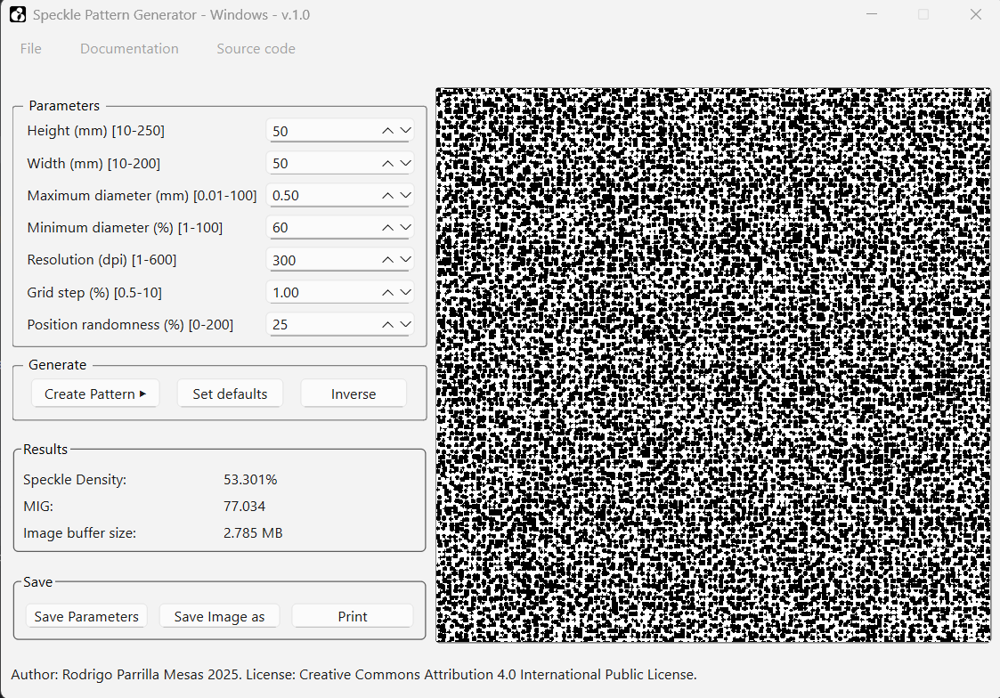

# Speckle Pattern Generator
Speckle Pattern Generator 2025 v1.0 by Rodrigo Parrilla Mesas is a free open-source application. It allows the user to generate a wide variety of speckle patterns used in Digital Image Correlation. 
Patterns are generated by introducing several control parameters and pushing the Regenerate button. A default pattern is generated as soon as the application is opened. 

## Parameters and speckle generator algorithm
The parameter box contains seven control parameters which are:
1.	Image height: in millimetres
2.	Image width: in millimetres
3.	Maximum speckle diameter: in millimetres
4.	Minimum speckle diameter: in millimetres
5.	Image resolution: in dots per inch
6.	Grid step: Axis separation as a percentage of the maximum diameter of the speckle
7.	Position randomness: Is the radius around its original position in the grid a speckle could be moved to as a percentage of the maximum diameter.

The pattern generator algorithm converts all the introduced values from millimetres to dots using the resolution parameter. Initially the returned image is a white image of the requested size plus some padding so there are no out of bounds writing problems. The image has to be divided by a square grid in whose nodes the speckles will be centered.
 
Next, a brand knew speckle buffer is created where all the unique speckles will be stored. Each unique speckle has a different diameter according to the maximum and minimum diameter specifications. One unique speckle is randomly selected from the speckle buffer and positioned in the grid; some random noise is added to its position according to the position randomness parameter.

Finally, the image is cropped to the required size and sent to the app for its rendering.
The pattern generator algorithm makes use of a simpler algorithm that generates each individual speckle. This algorithm creates an array of pixels the size of the maximum speckle diameter and paints black each pixel that is a speckle radius or less away from the centre of the image. Each unique speckle is created this way and the stored in the speckle buffer.
